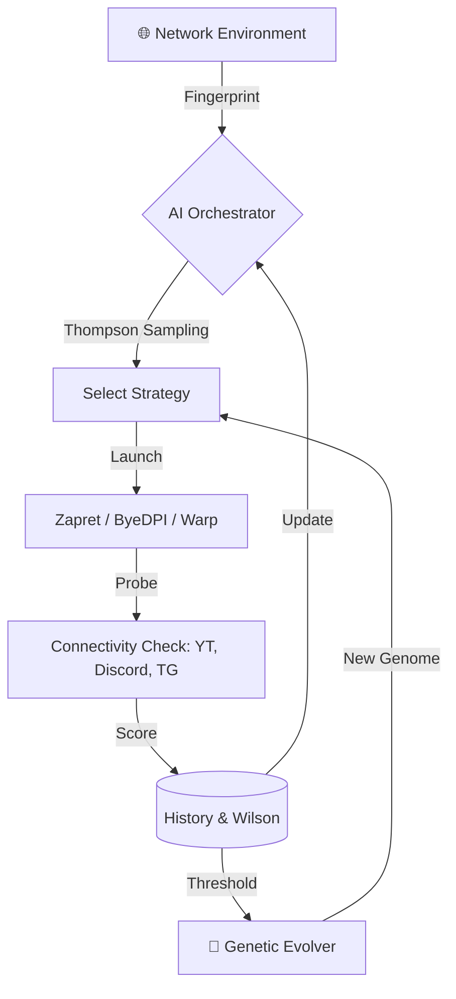

<picture>
    <source media="(prefers-color-scheme: dark)" srcset="./assets/FluxRoute-white.svg">
    <source media="(prefers-color-scheme: light)" srcset="./assets/FluxRoute-dark.svg">
    
</picture>

# FluxRoute AI `v1.6.2`

**Professional DPI Bypass Manager with Adaptive Intelligence and Cloudflare Warp support.**

[🇷🇺 Русская версия](README.md) | [📥 Download](https://github.com/mx57/FluxRoute_AI/releases) | [💬 Discussions](https://github.com/mx57/FluxRoute_AI/issues)

---

**FluxRoute AI** is a powerful extension of the original FluxRoute, transforming a static BAT file manager into a dynamic, self-learning system. The application doesn't just launch Zapret or ByeDPI—it **analyzes** connection quality and **evolves**, creating the perfect configuration for your specific network conditions.

---

## 💎 Fork Features (FluxRoute AI)

Unlike the original project, FluxRoute AI focuses on "last mile" automation—finding working parameters in environments with shifting DPI filters.

### 🧠 1. Advanced AI Orchestrator
*   **Thompson Sampling:** A mathematically sound way to pick strategies. The system balances using proven profiles with exploring new ones.
*   **Wilson Scoring:** Strategy ranking based on Wilson confidence intervals. More successful probes lead to higher profile "authority."
*   **Fast Start:** Upon startup or network change, the AI instantly tests the TOP-3 historically successful strategies, ensuring minimal downtime.
*   **Network Fingerprinting:** The AI recognizes if you are at home on Wi-Fi, in a café, or using a mobile modem. It maintains a separate policy for each network.

### 🧬 2. Genetic Strategy Evolution
*   **Auto-generating BATs:** The system crosses parameters of top-performing profiles and applies mutations (tweaking desync, split-pos, fake-tls, etc.), creating new profiles in `engine/ai-evolved/`.
*   **Natural Selection:** Profiles that fail quality checks are automatically removed, keeping the gene pool clean of "garbage" configs.

### 🌐 3. Full Cloudflare Warp Integration
*   **Built-in Warp (warp-plus):** Support for WireGuard and AmneziaWG protocols to bypass IP-based blocks.
*   **Config Generation:** Register and create Warp accounts directly within the app with a single click.
*   **Auto-MTU Tuning:** The AI automatically adjusts Warp's MTU size if it detects packet loss or instability.

### 🔗 4. Hybrid & Chained Modes
*   **Parallel:** Runs Zapret and Warp simultaneously.
*   **Chained:** Uses Warp as a SOCKS5 proxy for Zapret or ByeDPI. Double-layered protection.
*   **Hybrid:** Smart switching between Zapret and ByeDPI based on which strategy is currently more effective.

---

## 🚀 New in v1.6.2

*   **Warp Integration:** Added a dedicated Warp management tab and key generator.
*   **Improved Mutations:** AI can now evolve `DesyncAnyProtocol`, `DesyncFooling`, and `FakeResend` parameters.
*   **Cache Optimization:** Significantly faster probe history handling, reduced disk I/O.
*   **UI/UX:** Added engine type indicators to the strategy list and expanded network diagnostics.

---

## 🛠 How It Works (Architecture)

---

## 📅 Roadmap (Future Improvements)

*   [ ] **Sing-Box Support:** Integration of a universal core for VLESS/Vmess/Reality.
*   [ ] **Cloud Knowledge Base:** Ability to anonymously share successfully evolved genomes with other users.
*   [ ] **Deep YouTube Analysis:** Checking not just reachability, but video playback speed (buffering metrics).
*   [ ] **Local VPN Interface:** Built-in TUN/TAP provider to route all system traffic without relying solely on WinDivert.

---

## ⚠️ Important Note (WinDivert)

This application uses the **WinDivert** driver for low-level packet analysis. Some antivirus software may flag it as `HackTool` or `RiskTool`. This is a **false positive**. Please add FluxRoute to your security software exclusions.

---

## 🙏 Acknowledgments

*   **[klondike0x/FluxRoute](https://github.com/klondike0x/FluxRoute)** — Base of the project, excellent architecture.
*   **[bol-van/zapret](https://github.com/bol-van/zapret)** — The powerful core for Windows.
*   **[hiddify/warp-plus](https://github.com/hiddify/warp-plus)** — For the Warp implementation.

---

**[⭐ Star this repo](https://github.com/mx57/FluxRoute_AI) — it's the best motivation for development!**

[mx57](https://github.com/mx57) © 2026. Licensed under GPLv3.

