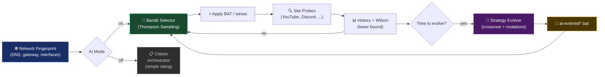

<div align="center">

<picture>
    <source media="(prefers-color-scheme: dark)" srcset="./assets/FluxRoute-white.svg">
    <source media="(prefers-color-scheme: light)" srcset="./assets/FluxRoute-dark.svg">
    
</picture>

# [FluxRoute Desktop](https://github.com/klondike0x/FluxRoute)

**Language:** [🇷🇺 Русский](README.md) | 🇬🇧 English

### Windows GUI with **self-learning AI orchestrator** for Flowseal zapret profiles

⭐️ **Star this repository — it's the best free way to support the project!**

**Author:** [klondike0x](https://github.com/klondike0x) · [📥 Releases](https://github.com/klondike0x/FluxRoute/releases) · [🐛 Issues](https://github.com/klondike0x/FluxRoute/issues) · [💬 Discussions](https://github.com/klondike0x/FluxRoute/discussions)

<p align="center">
    <a href="https://github.com/klondike0x/FluxRoute"></a>
    <a href="https://github.com/klondike0x/FluxRoute"></a>
    <a href="https://github.com/klondike0x/FluxRoute/actions/workflows/release.yml"></a>
    <a href="https://dotnet.microsoft.com/"></a>
    <a href="https://github.com/klondike0x/FluxRoute/releases"></a>
    <a href="https://github.com/klondike0x/FluxRoute/releases"></a>
    <a href="./LICENSE"></a>
</p>

</div>

---

> [!IMPORTANT]
> **This is the original FluxRoute Desktop repository.**
> 
> All derivative projects (forks) are based on this code. GitHub automatically marks them with `forked from klondike0x/FluxRoute`.

**FluxRoute Desktop** is a modern GUI wrapper for managing [`Flowseal/zapret-discord-youtube`](https://github.com/Flowseal/zapret-discord-youtube) profiles with a unique **AI orchestrator** powered by Thompson Sampling and genetic strategy evolution.

Launch, update, and switch profiles from a single window — no manual BAT-file editing required.

> 🌍 **Note:** FluxRoute is part of the **zapret ecosystem** — a set of tools for DPI (Deep Packet Inspection) bypass, primarily used in CIS countries to access blocked services like YouTube, Discord, Instagram, and Telegram. The main community is Russian-speaking, but the tool itself works anywhere DPI-based filtering is used.

---

## ✨ Features

### 🧠 Intelligence & Automation

| Feature | Description |
|---------|-------------|
| 🎯 **AI Orchestrator** | Thompson Sampling for self-learning strategy selection tailored to your network |
| 🧬 **Genetic Evolution** | Crossover of top strategies + zapret parameter mutations → new BATs in `engine/ai-evolved/` |
| 🌐 **Network Fingerprint** | Adapts AI policy per network (Wi-Fi ↔ Ethernet, different DNS) |
| 📊 **Classic Orchestrator** | Scans all profiles, rates 0-100%, auto-switches to the best on failure |
| ⚙️ **Auto-Tune** | Automatically finds the optimal IPSet × GameFilter combination |
| 🎮 **Process Triggers** | Auto-switches presets when games/apps launch (e.g., `rocketleague.exe`) |

### 🔌 Integrations

| Feature | Description |
|---------|-------------|
| 📡 **TG WS Proxy** | Built-in Telegram proxy installer with fallback mirror (astral-sh) |
| 🔄 **Auto-update engine/** | Checks new Flowseal releases via GitHub Releases Atom feed (no API limits) |
| 🆙 **App auto-update** | Downloads and atomically installs new FluxRoute versions with SHA-256 verification |
| 🌍 **Domain Manager** | Add custom sites and exclusions for orchestrator checks via UI |

### 🎨 Interface

| Feature | Description |
|---------|-------------|
| 💎 **Compact UI** | Single Start/Stop button, status and logs always in view — no cluttered menus |
| 🖥 **Tray support** | Minimize to tray with balloon notifications |
| 🛡 **Hidden launch** | BAT files and `winws.exe` run in the background without console windows |
| 🚀 **Windows startup** | Registry autorun (`HKCU\...\Run`) with `--autostart` flag |
| ⚡ **Profile auto-launch** *(planned)* | Automatically starts the last used profile on system boot |

### 🛡️ Security

| Feature | Description |
|---------|-------------|
| 🔒 **GitHub Actions** | Transparent CI/CD builds — every release compiled automatically from source |
| ✅ **SHA-256 verification** | Release hashes logged for integrity checks |
| 🔄 **Atomic updates** | Staging → backup → rollback on errors (no broken installations) |
| 👮 **Admin rights check** | UAC elevation prompt on launch + clear error messages |

### 🔧 Diagnostics

| Feature | Description |
|---------|-------------|
| 📊 **Extended diagnostics** | Checks WinDivert, BFE, TCP timestamps, VPN, AdGuard, DNS, ISP |
| 💾 **Diagnostic bundle** | ZIP export with all logs, settings, and system info for debugging |
| 📋 **Real-time logs** | Logs tab with filtering, export, and history |
| 🌐 **Availability checks** | Tests YouTube, Discord, Google, Twitch, Instagram, Telegram, and more |

### 🎨 Ecosystem

| Feature | Description |
|---------|-------------|
| 📦 **Portable** | Runs from any folder, no installation required |
| 🧪 **Unit tests** | Coverage for bandit, evolver, parser, fingerprint |
| 📖 **Open source** | GPL-3.0 — anyone can inspect what the app does |
| 🚫 **No telemetry** | FluxRoute does not collect user data |

---

## 🆚 How FluxRoute differs from other GUIs

FluxRoute is the **only** GUI with a full-fledged AI subsystem:

| Category | FluxRoute | Zapret-Hub | Zapret-GUI | Zapret2 GUI | ZapretControl |
|----------|:---------:|:----------:|:----------:|:-----------:|:-------------:|
| 🧠 AI Orchestrator (Thompson Sampling) | ✅ | ❌ | ❌ | ❌ | ❌ |
| 🧬 Genetic strategy evolution | ✅ | ❌ | ❌ | ❌ | ❌ |
| 🎮 Process triggers (by .exe) | ✅ | ❌ | ❌ | ❌ | ❌ |
| ⚙️ Auto-Tune (IPSet × GameFilter) | ✅ | ❌ | ❌ | ❌ | ❌ |
| 📡 Built-in TG WS Proxy | ✅ | ✅ | ❌ | ❌ | ❌ |
| 🤖 AI DNS (ChatGPT, Claude, Gemini) | ❌ | ❌ | ✅ | ✅ | ❌ |
| 💬 Telegram Desktop unlock | ❌ | ❌ | ✅ | ❌ | ❌ |
| 📚 80+ built-in strategies | ❌ | ❌ | ❌ | ✅ | ❌ |
| 🎨 Themes (5+) and i18n | ❌ | ✅ | ✅ | ❌ | ❌ |
| 📦 Portable + installer | ❌ | ✅ | ❌ | ❌ | ❌ |
| 🔒 GitHub Actions (transparent builds) | ✅ | ❌ | ❌ | ❌ | ❌ |
| 🔄 Atomic engine updates | ✅ | ⚠️ | ✅ | ❌ | ❌ |

> **Key difference:** FluxRoute is the only project where AI **autonomously selects and evolves** strategies for your network via Thompson Sampling and genetic algorithms. Other GUIs are convenient wrappers with static profiles or niche features (AI DNS, Telegram, mods).

---

## 🚀 Quick Start

### Requirements
- **Windows 10/11 x64**
- **Administrator privileges** (for `winws.exe` and WinDivert)

### Installation

1. Download the latest release: [**Releases**](https://github.com/klondike0x/FluxRoute/releases)
2. Extract the ZIP to any folder (e.g., `C:\FluxRoute\`)
3. Run `FluxRoute.exe` **as Administrator**
4. Wait for automatic `engine/` download from Flowseal
5. Select a profile and click **▶ Start**

### First Launch with AI

1. Update `engine/` on the **Updates** tab
2. Enable **AI mode** on the **AI** tab
3. Launch the **orchestrator** on the **Orchestrator** tab
4. Done — AI will automatically pick the best strategy for your network

---

## 🧠 AI Orchestrator

The unique `FluxRoute.AI` subsystem, not found in other GUIs:

| Component | Purpose |
|-----------|---------|
| **Strategy Genome** | Typed strategy representation (filters, desync, split, fake TLS) |
| **Bandit Selector** | Strategy selection via Thompson Sampling with configurable exploration |
| **Strategy Evolver** | Crossover of top genomes by Wilson lower bound; parameter mutations |
| **Network Fingerprint** | Network signature (DNS, gateway, interfaces) — separate policy per network |
| **AiHistoryStore** | Probe log in `fluxroute-ai-history.jsonl` |
| **AiStrategyRegistry** | Genome registry, bandit state, generation counter |
| **BatMaterializer** | Writes evolved strategies to `engine/ai-evolved/*.bat` |

### How the AI Orchestrator Works



### Workflow

1. 🌐 **Network Fingerprint** — capture DNS, gateway, interfaces
2. 🎰 **Bandit Selector** — pick a strategy via Thompson Sampling
3. ⚡ **Apply BAT** — launch `winws.exe` with strategy parameters
4. 🔍 **Site Probes** — check availability of YouTube, Discord, etc.
5. 📊 **History + Wilson** — update success statistics
6. 🧬 **Evolution** — periodically crossover the best strategies
7. 📁 **`ai-evolved/`** — new BAT files are saved automatically

---

## 📸 Interface

<table>
<tr>
<td></td>
<td></td>
</tr>
<tr>
<td></td>
<td></td>
</tr>
</table>

---

## 🔧 Troubleshooting

> [!IMPORTANT]
> For any issues, try:
> 1. Run as **Administrator**
> 2. Update `engine/` on the **Updates** tab
> 3. Run **Scan all profiles** on the **Orchestrator** tab
> 4. Enable **Auto-Tune** on the **Service** tab

### ❌ TG WS Proxy won't install (SSL error)

In networks with DPI blocking `python.org`, use **Firefox** for manual download:

1. Download: https://www.python.org/ftp/python/3.11.9/python-3.11.9-embed-amd64.zip
2. Extract to `tg-proxy\python\`
3. In FluxRoute: **TG Proxy** tab → **Install TG WS Proxy**

**Starting with v1.5.1** — automatic fallback to `astral-sh` mirror (GitHub CDN).

### ❌ `ModuleNotFoundError: No module named 'proxy.pool'`

The old installer didn't fetch new files. Fix:

1. Download https://github.com/Flowseal/tg-ws-proxy/archive/main.zip
2. Copy the `proxy/` folder to `tg-proxy\proxy\`
3. Restart the proxy

**Starting with v1.5.1** — the installer downloads the entire repository as a ZIP archive.

### ❌ Profile not working (0%)

1. Ensure **GameFilter** = `TCP and UDP`
2. **IPSet Mode** = `loaded`
3. Run **Auto-Tune** on the **Service** tab
4. Check extended diagnostics (**Diagnostics** tab)

### ❌ Port 1443 is busy (TG Proxy)

```cmd
netstat -ano | findstr :1443
taskkill /PID <number> /F
```

---

## ⚠️ WinDivert and Antivirus

> [!WARNING]
> The project uses **WinDivert** — a legitimate traffic interception tool required for zapret to work.
> 
> It is **not a virus** by itself, but antiviruses may classify it as `Not-a-virus:RiskTool.Multi.WinDivert` or `HackTool`.

**What to do:**

- Add the FluxRoute folder to your **antivirus exclusions**
- Disable **PUA** (Potentially Unwanted Application) detection
- In Kaspersky: uncheck *"Detect legal applications that attackers often use"*

---

## 🔒 Security

- ✅ **GitHub Actions** — all releases are built automatically and transparently
- ✅ **SHA-256 hashes** — every download is verified in the logs
- ✅ **Open source** — anyone can audit what the app does
- ✅ **No telemetry** — FluxRoute does not collect user data
- ✅ **Portable** — no installation required, runs from a folder
- ✅ **Atomic updates** — staging → backup → rollback on errors

> [!TIP]
> App updates always come only from the official `klondike0x/FluxRoute` repository — the URL is hardcoded in `AppUpdaterService`. This ensures that even fork users eventually receive the original version.

---

## 🛠 For Developers

### Requirements

- .NET 10 SDK
- Visual Studio 2022/2026 or JetBrains Rider

### Building from Source

```bash
git clone https://github.com/klondike0x/FluxRoute.git
cd FluxRoute
dotnet build
dotnet run --project FluxRoute
```

### Project Structure

```
FluxRoute/
├── FluxRoute/              — UI (WPF, Views, ViewModels, AI tab)
├── FluxRoute.Core/         — Logic (Orchestrator, connectivity checks, models)
├── FluxRoute.AI/           — AI engine (bandit, evolver, fingerprint, registry)
├── FluxRoute.Core.Tests/   — Unit tests (bandit, evolver, parser, fingerprint)
├── FluxRoute.Updater/      — Auto-update engine/ from GitHub
└── engine/                 — Flowseal scripts (downloaded automatically)
    └── ai-evolved/         — BAT strategies created by evolution
```

### Contributing

1. Fork the repository
2. Create a branch: `git checkout -b feature/my-feature`
3. Commit: `git commit -m "feat: add my feature"`
4. Push: `git push origin feature/my-feature`
5. Open a **Pull Request**

---

## 📜 Derivative Projects Attribution

> [!IMPORTANT]
> **When developing projects based on FluxRoute, you must attribute the original author 
> and upstream projects listed in the Ecosystem section.**
>
> This is required by the **GPL-3.0** license (§4 — preserve copyright notices, 
> §5 — prominent notices of changes).

**Minimum requirements for forks and derivative projects:**

1. ✅ Add to README: `> **Original project:** [klondike0x/FluxRoute](https://github.com/klondike0x/FluxRoute)`
2. ✅ Preserve all upstream attributions (Flowseal, bol-van, WinDivert)
3. ✅ Mark changes with date (e.g., "Modified by [author] on [date]")
4. ✅ Do not mislead users about authorship

**Example of correct attribution in fork README:**

```markdown
> **Original project:** [klondike0x/FluxRoute](https://github.com/klondike0x/FluxRoute)
>
> This fork is based on FluxRoute Desktop and extends it with additional 
> AI features. Changes made by [author] [date].
```

---

## 🌳 Ecosystem

FluxRoute leverages the following project ecosystem:

- **[WinDivert](https://github.com/basil00/WinDivert)** — low-level Windows foundation
- **[bol-van/zapret](https://github.com/bol-van/zapret)** — original project
- **[bol-van/zapret-win-bundle](https://github.com/bol-van/zapret-win-bundle)** — Windows bundle with `winws.exe`
- **[Flowseal/zapret-discord-youtube](https://github.com/Flowseal/zapret-discord-youtube)** — the `engine/` base used in FluxRoute
- **[Flowseal/tg-ws-proxy](https://github.com/Flowseal/tg-ws-proxy)** — Telegram WebSocket proxy

### Projects That Inspired FluxRoute

- **[Zapret-GUI](https://github.com/medvedeff-true/Zapret-GUI)** — by `medvedeff-true`
- **[ZapretControl](https://github.com/Virenbar/ZapretControl)** — by `Virenbar`
- **[Zapret-Hub](https://github.com/goshkow/Zapret-Hub)** — by `goshkow`
- **[zapret](https://github.com/youtubediscord/zapret)** — by `youtubediscord`

---

## 🌟 Derivative Projects

| Project | Author | Status |
|---------|--------|--------|
| **FluxRoute** (this one) | [klondike0x](https://github.com/klondike0x) | ✅ Original, actively maintained |
| FluxRoute_AI | [mx57](https://github.com/mx57/FluxRoute_AI) | Fork with AI extensions |

If you've created a fork or extension — open an Issue to get it added to this list.

---

## 📜 License

This project is distributed under the **GNU General Public License v3.0**.

See the [LICENSE](LICENSE) file for details.

For fork developers: see the [Derivative Projects Attribution](#📜Derivative-Projects-Attribution) section.

FluxRoute Desktop is a **GUI wrapper** for the `Flowseal/zapret-discord-youtube` project.
All rights to `zapret`, `winws.exe`, and related scripts belong to their respective authors.
This repository does not claim authorship of the original low-level networking components.

---

<div align="center">

**Made with ❤️ for the community** · Author: [klondike0x](https://github.com/klondike0x) · [⭐ Star this repo](https://github.com/klondike0x/FluxRoute) · [🐛 Report a bug](https://github.com/klondike0x/FluxRoute/issues) · [💬 Ask a question](https://github.com/klondike0x/FluxRoute/discussions)

</div>
