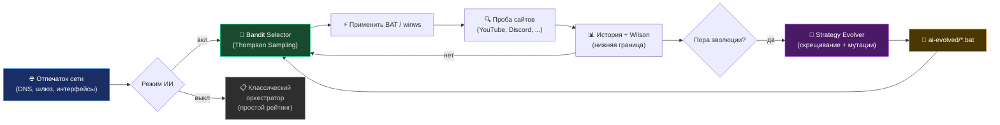

<div align="center">

<picture>
    <source media="(prefers-color-scheme: dark)" srcset="./assets/FluxRoute-white.svg">
    <source media="(prefers-color-scheme: light)" srcset="./assets/FluxRoute-dark.svg">
    
</picture>

# [FluxRoute Desktop](https://github.com/klondike0x/FluxRoute)

**Language:** 🇷🇺 Русский | [🇬🇧 English](README.en.md)

### Windows GUI с **самообучающимся ИИ-оркестратором** для zapret-профилей Flowseal

⭐️ **Поставьте звезду этому репозиторию — это лучшая бесплатная поддержка проекта!**

**Автор:** [klondike0x](https://github.com/klondike0x) · [📥 Релизы](https://github.com/klondike0x/FluxRoute/releases) · [🐛 Issues](https://github.com/klondike0x/FluxRoute/issues) · [💬 Discussions](https://github.com/klondike0x/FluxRoute/discussions)

<p align="center">
    <a href="https://github.com/klondike0x/FluxRoute"></a>
    <a href="https://github.com/klondike0x/FluxRoute"></a>
    <a href="https://github.com/klondike0x/FluxRoute/releases"></a>
    <a href="https://github.com/klondike0x/FluxRoute/releases"></a>
    <a href="https://github.com/klondike0x/FluxRoute/actions/workflows/release.yml"></a>
    <a href="https://dotnet.microsoft.com/"></a>
    <a href="./LICENSE"></a>
</p>

</div>

---

> [!IMPORTANT]
> **Это оригинальный репозиторий FluxRoute Desktop.**
>
> Все производные проекты (форки) основаны на этом коде. GitHub автоматически помечает их надписью `forked from klondike0x/FluxRoute`.

**FluxRoute Desktop** — современная GUI-оболочка для управления профилями [`Flowseal/zapret-discord-youtube`](https://github.com/Flowseal/zapret-discord-youtube) с уникальным **ИИ-оркестратором** на основе Thompson Sampling и генетической эволюции стратегий.

Запускайте, обновляйте и переключайте профили в одном окне — без ручного редактирования BAT-файлов.

---

## ✨ Возможности

### 🧠 Интеллект и автоматизация

| Фича                            | Описание                                                                                    |
| ------------------------------- | ------------------------------------------------------------------------------------------- |
| 🎯 **ИИ-оркестратор**           | Thompson Sampling для самообучаемого подбора стратегий под вашу сеть                        |
| 🧬 **Генетическая эволюция**    | Скрещивание лучших стратегий + мутации параметров zapret → новые BAT в `engine/ai-evolved/` |
| 🌐 **Network Fingerprint**      | Адаптация ИИ-политики под каждую сеть (Wi-Fi ↔ Ethernet, разные DNS)                        |
| 📊 **Классический оркестратор** | Сканирование всех профилей, рейтинг 0-100%, автопереключение на лучший при сбое             |
| ⚙️ **Auto-Tune**                | Автоматический подбор оптимальной комбинации IPSet × GameFilter                             |
| 🎮 **Процесс-триггеры**         | Автопереключение пресетов при запуске игр/приложений (например, `rocketleague.exe`)         |

### 🔌 Интеграции

| Фича                             | Описание                                                                           |
| -------------------------------- | ---------------------------------------------------------------------------------- |
| 📡 **TG WS Proxy**               | Встроенная установка Telegram-прокси с fallback-зеркалом (astral-sh mirror)        |
| 🔄 **Автообновление engine/**    | Проверка новых релизов Flowseal через GitHub Releases (Atom feed, без API-лимитов) |
| 🆙 **Автообновление приложения** | Скачивание и атомарная установка новых версий FluxRoute с SHA-256 верификацией     |
| 🌍 **Менеджер доменов**          | Добавление своих сайтов и исключений для проверки оркестратором через UI           |

### 🎨 Интерфейс

| Фича                                   | Описание                                                                      |
| -------------------------------------- | ----------------------------------------------------------------------------- |
| 💎 **Компактный UI**                   | Одна кнопка Start/Stop, статус и логи всегда на виду — без перегруженных меню |
| 🖥 **Работа в трее**                   | Сворачивание в трей с balloon-уведомлениями о статусе                         |
| 🛡 **Скрытый запуск**                  | BAT-файлы и `winws.exe` работают в фоне без консольных окон                   |
| 🚀 **Автозапуск с Windows**            | Регистрация в реестре (`HKCU\...\Run`) с флагом `--autostart`                 |
| ⚡ **Автозапуск профиля** _(в планах)_ | Автоматический запуск последнего профиля при старте системы                   |

### 🛡️ Безопасность

| Фича                                | Описание                                                                      |
| ----------------------------------- | ----------------------------------------------------------------------------- |
| 🔒 **GitHub Actions**               | Прозрачная CI/CD-сборка — каждый релиз собирается автоматически из исходников |
| ✅ **SHA-256 верификация**          | Хеши релизов логируются для проверки целостности скачанных файлов             |
| 🔄 **Атомарные обновления**         | Staging → backup → rollback при ошибках (никаких "поломанных" установок)      |
| 👮 **Проверка прав администратора** | UAC elevation prompt при запуске + понятные сообщения об ошибках              |

### 🔧 Диагностика

| Фича                           | Описание                                                                     |
| ------------------------------ | ---------------------------------------------------------------------------- |
| 📊 **Расширенная диагностика** | Проверка WinDivert, BFE, TCP timestamps, VPN, AdGuard, DNS, провайдера       |
| 💾 **Диагностический бандл**   | Экспорт ZIP со всеми логами, настройками и системной информацией для отладки |
| 📋 **Логи в реальном времени** | Вкладка "Логи" с фильтрацией, экспортом и историей                           |
| 🌐 **Проверка доступности**    | Тест YouTube, Discord, Google, Twitch, Instagram, Telegram и других сайтов   |

### 🎨 Экосистема

| Фича                         | Описание                                                |
| ---------------------------- | ------------------------------------------------------- |
| 📦 **Portable**              | Работает из любой папки без установки                   |
| 🧪 **Unit-тесты**            | Покрытие для bandit, evolver, parser, fingerprint       |
| 📖 **Открытый исходный код** | GPL-3.0 — каждый может проверить, что делает приложение |
| 🚫 **Без телеметрии**        | FluxRoute не собирает данные пользователей              |

---

## 🆚 Чем FluxRoute отличается от других GUI

FluxRoute — **единственный** GUI с полноценной ИИ-подсистемой:

| Категория                             | FluxRoute | Zapret-Hub | Zapret-GUI | Zapret2 GUI | ZapretControl |
| ------------------------------------- | :-------: | :--------: | :--------: | :---------: | :-----------: |
| 🧠 ИИ-оркестратор (Thompson Sampling) |    ✅     |     ❌     |     ❌     |     ❌      |      ❌       |
| 🧬 Генетическая эволюция стратегий    |    ✅     |     ❌     |     ❌     |     ❌      |      ❌       |
| 🎮 Process-triggers (авто по .exe)    |    ✅     |     ❌     |     ❌     |     ❌      |      ❌       |
| ⚙️ Auto-Tune (IPSet × GameFilter)     |    ✅     |     ❌     |     ❌     |     ❌      |      ❌       |
| 📡 TG WS Proxy встроенный             |    ✅     |     ✅     |     ❌     |     ❌      |      ❌       |
| 🤖 AI DNS (ChatGPT, Claude, Gemini)   |    ❌     |     ❌     |     ✅     |     ✅      |      ❌       |
| 💬 Разблокировка Telegram Desktop     |    ❌     |     ❌     |     ✅     |     ❌      |      ❌       |
| 📚 80+ стратегий из коробки           |    ❌     |     ❌     |     ❌     |     ✅      |      ❌       |
| 🎨 Темы (5+) и многоязычность         |    ❌     |     ✅     |     ✅     |     ❌      |      ❌       |
| 📦 Portable + установщик              |    ❌     |     ✅     |     ❌     |     ❌      |      ❌       |
| 🔒 GitHub Actions (прозрачная сборка) |    ✅     |     ❌     |     ❌     |     ❌      |      ❌       |
| 🔄 Атомарные обновления engine        |    ✅     |     ⚠️     |     ✅     |     ❌      |      ❌       |

> **Главное отличие:** FluxRoute — единственный проект, где ИИ **сам подбирает и эволюционирует** стратегии под вашу сеть через Thompson Sampling и генетический алгоритм. Остальные GUI — это удобные обёртки со статическими профилями или специфичными фичами (AI DNS, Telegram, моды).

---

## 🚀 Быстрый старт

### Требования

- **Windows 10/11 x64**
- **Права администратора** (для работы `winws.exe` и WinDivert)

### Установка

1. Скачайте последний релиз: [**Releases**](https://github.com/klondike0x/FluxRoute/releases)
2. Распакуйте ZIP в любую папку (например, `C:\FluxRoute\`)
3. Запустите `FluxRoute.exe` **от имени администратора**
4. Дождитесь автоматической загрузки `engine/` с Flowseal
5. Выберите профиль и нажмите **▶ Запустить**

### Первый запуск с ИИ

1. Обновите `engine/` на вкладке **Обновления**
2. Включите **режим ИИ** на вкладке **ИИ**
3. Запустите **оркестратор** на вкладке **Оркестратор**
4. Готово — ИИ автоматически подберёт лучшую стратегию под вашу сеть

---

## 🧠 ИИ-оркестратор

Уникальная подсистема `FluxRoute.AI`, которой нет в других GUI:

| Компонент               | Назначение                                                                 |
| ----------------------- | -------------------------------------------------------------------------- |
| **Strategy Genome**     | Типизированное представление стратегии (фильтры, desync, split, fake TLS)  |
| **Bandit Selector**     | Выбор стратегии через Thompson Sampling с настраиваемым exploration        |
| **Strategy Evolver**    | Скрещивание лучших геномов по нижней границе Wilson; мутации параметров    |
| **Network Fingerprint** | Отпечаток сети (DNS, шлюз, интерфейсы) — отдельная политика на каждую сеть |
| **AiHistoryStore**      | Журнал проб в `fluxroute-ai-history.jsonl`                                 |
| **AiStrategyRegistry**  | Реестр геномов, bandit-состояние, счётчик поколений                        |
| **BatMaterializer**     | Запись эволюционированных стратегий в `engine/ai-evolved/*.bat`            |

### Как работает ИИ-оркестратор



### Цикл работы

1. 🌐 **Отпечаток сети** — фиксируем DNS, шлюз, интерфейсы
2. 🎰 **Bandit Selector** — выбираем стратегию через Thompson Sampling
3. ⚡ **Применяем BAT** — запускаем `winws.exe` с параметрами стратегии
4. 🔍 **Проба сайтов** — проверяем доступность YouTube, Discord и др.
5. 📊 **История + Wilson** — обновляем статистику успешности
6. 🧬 **Эволюция** — периодически скрещиваем лучшие стратегии
7. 📁 **`ai-evolved/`** — новые BAT-файлы сохраняются автоматически

---

## 📸 Интерфейс

<table>
<tr>
<td></td>
<td></td>
</tr>
<tr>
<td></td>
<td></td>
</tr>
</table>

---

## 🔧 Troubleshooting

> [!IMPORTANT]
> При любых проблемах попробуйте:
>
> 1. Запустить от имени **администратора**
> 2. Обновить `engine/` на вкладке **Обновления**
> 3. Запустить **Сканировать все профили** на вкладке **Оркестратор**
> 4. Включить **Auto-Tune** на вкладке **Сервис**

### ❌ TG WS Proxy не устанавливается (SSL-ошибка)

В сетях с DPI-блокировками `python.org` используйте **Firefox** для ручной загрузки:

1. Скачайте: `https://www.python.org/ftp/python/3.11.9/python-3.11.9-embed-amd64.zip`
2. Распакуйте в `tg-proxy\python\`
3. В FluxRoute: вкладка **TG Прокси** → **Установить TG WS Proxy**

**После выхода v1.5.1** — автоматический fallback на `astral-sh` mirror (GitHub CDN).

### ❌ `ModuleNotFoundError: No module named 'proxy.pool'`

Старая версия установщика не скачивала новые файлы. Решение:

1. Скачайте `https://github.com/Flowseal/tg-ws-proxy/archive/main.zip`
2. Скопируйте папку `proxy/` в `tg-proxy\proxy\`
3. Перезапустите прокси

**После выхода v1.5.1** — установщик скачивает весь репозиторий ZIP-архивом.

### ❌ Профиль не работает (0%)

1. Убедитесь, что **GameFilter** = `TCP и UDP`
2. **IPSet Mode** = `loaded`
3. Запустите **Auto-Tune** на вкладке **Сервис**
4. Проверьте расширенную диагностику (вкладка **Диагностика**)

### ❌ Порт 1443 занят (TG Proxy)

```cmd
netstat -ano | findstr :1443
taskkill /PID <число> /F
```

---

## ⚠️ WinDivert и антивирусы

> [!WARNING]
> В проекте используется **WinDivert** — легитимный инструмент для перехвата трафика, необходимый для работы zapret.
>
> Сам по себе он **не является вирусом**, но антивирусы могут классифицировать его как `Not-a-virus:RiskTool.Multi.WinDivert` или `HackTool`.

**Что делать:**

- Добавьте папку FluxRoute в **исключения антивируса**
- Отключите детект **PUA** (потенциально нежелательных приложений)
- В Kaspersky: снимите галочку _"Обнаруживать легальные приложения, которые злоумышленники часто используют"_

---

## 🔒 Безопасность

- ✅ **GitHub Actions** — все релизы собираются автоматически, прозрачно
- ✅ **SHA-256 хеши** — каждая загрузка верифицируется в логах
- ✅ **Открытый исходный код** — каждый может проверить, что делает приложение
- ✅ **Нет телеметрии** — FluxRoute не собирает данные пользователей
- ✅ **Портативный** — не требует установки, работает из папки
- ✅ **Атомарные обновления** — staging → backup → rollback при ошибках

> [!TIP]
> Обновления приложения всегда приходят только с официального репозитория `klondike0x/FluxRoute` — URL зашит в `AppUpdaterService`. Это гарантирует, что даже пользователи форков в итоге получают оригинальную версию.

---

## 🛠 Для разработчиков

### Требования

- .NET 10 SDK
- Visual Studio 2022/2026 или JetBrains Rider

### Сборка из исходников

```bash
git clone https://github.com/klondike0x/FluxRoute.git
cd FluxRoute
dotnet build
dotnet run --project FluxRoute
```

### Структура проекта

```
FluxRoute/
├── FluxRoute/              — UI (WPF, Views, ViewModels, вкладка «ИИ»)
├── FluxRoute.Core/         — Логика (Оркестратор, Проверка связи, Модели)
├── FluxRoute.AI/           — ИИ-движок (bandit, evolver, fingerprint, registry)
├── FluxRoute.Core.Tests/   — Unit-тесты (bandit, evolver, parser, fingerprint)
├── FluxRoute.Updater/      — Автообновление engine/ с GitHub
└── engine/                 — Скрипты Flowseal (скачиваются автоматически)
    └── ai-evolved/         — BAT-стратегии, созданные эволюцией
```

### Вклад в проект

1. Форкните репозиторий
2. Создайте ветку: `git checkout -b feature/my-feature`
3. Сделайте коммит: `git commit -m "feat: add my feature"`
4. Запушьте: `git push origin feature/my-feature`
5. Откройте **Pull Request**

---

## 📜 Атрибуция производных проектов

> [!IMPORTANT]
> **При разработке проектов на основе FluxRoute обязательно указывайте оригинального автора и upstream-проекты, перечисленные в разделе «Экосистема».**
>
> Этого требует лицензия **GPL-3.0** (§4 — сохранение copyright notices, §5 — заметные пометки об изменениях).

**Минимальные требования к форкам и производным проектам:**

1. ✅ Указать в README: `> **Оригинальный проект:** [klondike0x/FluxRoute](https://github.com/klondike0x/FluxRoute)`
2. ✅ Сохранить все upstream-атрибуции (Flowseal, bol-van, WinDivert)
3. ✅ Пометить изменения с датой (например, "Modified by [author] on [date]")
4. ✅ Не вводить пользователей в заблуждение относительно авторства

**Почему это важно:**

- 🤝 **Уважение к труду** — сотни часов разработки архитектуры, UI, ИИ-подсистемы
- 🔍 **Прозрачность** — пользователи должны понимать, где оригинал, а где форк
- 📜 **GPL-3.0** — лицензия, под которой распространяется код, прямо требует атрибуции
- 🛡 **Защита пользователей** — от получения модифицированных версий без проверки безопасности

**Пример правильной атрибуции в README форка:**

```markdown
> **Оригинальный проект:** [klondike0x/FluxRoute](https://github.com/klondike0x/FluxRoute)
>
> Этот форк основан на FluxRoute Desktop и расширяет его возможности
> дополнительными AI-функциями. Изменения внесены [автор] [дата].
```

---

## 🌳 Экосистема

FluxRoute использует экосистему проектов:

- **[WinDivert](https://github.com/basil00/WinDivert)** — низкоуровневая Windows-основа
- **[bol-van/zapret](https://github.com/bol-van/zapret)** — оригинальный проект
- **[bol-van/zapret-win-bundle](https://github.com/bol-van/zapret-win-bundle)** — Windows-бандл с `winws.exe`
- **[Flowseal/zapret-discord-youtube](https://github.com/Flowseal/zapret-discord-youtube)** — основа `engine/`, используемая в FluxRoute
- **[Flowseal/tg-ws-proxy](https://github.com/Flowseal/tg-ws-proxy)** — Telegram WebSocket прокси

### Проекты, которые вдохновили

- **[Zapret-GUI](https://github.com/medvedeff-true/Zapret-GUI)** — от `medvedeff-true`
- **[ZapretControl](https://github.com/Virenbar/ZapretControl)** — от `Virenbar`
- **[Zapret-Hub](https://github.com/goshkow/Zapret-Hub)** — от `goshkow`
- **[zapret](https://github.com/youtubediscord/zapret)** — от `youtubediscord`

---

## 🌟 Производные проекты

| Проект               | Автор                                        | Статус                           |
| -------------------- | -------------------------------------------- | -------------------------------- |
| **FluxRoute** (этот) | [klondike0x](https://github.com/klondike0x)  | ✅ Оригинал, активно развивается |
| FluxRoute_AI         | [mx57](https://github.com/mx57/FluxRoute_AI) | Форк с AI-расширениями           |

Если вы создали форк или расширение — откройте Issue, чтобы добавить его в список.

---

## 📜 Лицензия

Проект распространяется по лицензии **GNU General Public License v3.0**.

Подробности — в файле [LICENSE](LICENSE).

**Для разработчиков форков:** см. раздел [Атрибуция производных проектов](#-атрибуция-производных-проектов).

FluxRoute Desktop является **GUI-оболочкой** для проекта `Flowseal/zapret-discord-youtube`.
Все права на `zapret`, `winws.exe` и связанные с ними скрипты принадлежат их авторам.
Этот репозиторий не претендует на авторство оригинальной низкоуровневой сетевой части.

---

<div align="center">

**Сделано с ❤️ для сообщества** · Автор: [klondike0x](https://github.com/klondike0x) · [⭐ Поставить звезду](https://github.com/klondike0x/FluxRoute) · [🐛 Сообщить о баге](https://github.com/klondike0x/FluxRoute/issues) · [💬 Задать вопрос](https://github.com/klondike0x/FluxRoute/discussions)

</div>
