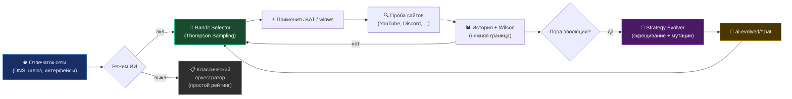

<div align="center">

<picture>
    <source media="(prefers-color-scheme: dark)" srcset="./assets/FluxRoute-white.svg">
    <source media="(prefers-color-scheme: light)" srcset="./assets/FluxRoute-dark.svg">
    
</picture>

# [FluxRoute AI](https://github.com/mx57/FluxRoute_AI)

**Language:** 🇷🇺 Русский | [🇬🇧 English](README.en.md)

### ⚡ Автоматизация zapret-профилей с умным переключением и самообучаемым ИИ

⭐️ **Поставьте звезду этому репозиторию — это лучшая бесплатная поддержка проекта!**

**Автор форка:** [mx57](https://github.com/mx57) · [📥 Релизы](https://github.com/mx57/FluxRoute_AI/releases) · [🐛 Issues](https://github.com/mx57/FluxRoute_AI/issues)

<p align="center">
    <a href="https://github.com/mx57/FluxRoute_AI"></a>
    <a href="https://github.com/mx57/FluxRoute_AI/releases"></a>
    <a href="https://github.com/mx57/FluxRoute_AI/releases"></a>
    <a href="https://dotnet.microsoft.com/"></a>
    <a href="./LICENSE"></a>
</p>

</div>

---

> **Оригинальный проект:** [klondike0x/FluxRoute](https://github.com/klondike0x/FluxRoute)
>
> Этот форк основан на FluxRoute Desktop и расширяет его возможности
> дополнительными AI-функциями. Изменения внесены mx57 в 2026 году.

**FluxRoute AI** — расширение оригинального [FluxRoute Desktop](https://github.com/klondike0x/FluxRoute) с уникальной **самообучающейся ИИ-подсистемой** на основе Thompson Sampling и генетической эволюции стратегий.

ИИ не заменяет zapret — он **управляет тем, какой BAT-профиль запускать**, накапливает опыт по сети и **создаёт новые варианты** на основе удачных конфигураций.

---

## ✨ Уникальные AI-возможности (в этом форке)

| Фича | Описание |
|------|----------|
| 🧠 **ИИ-оркестратор** | Thompson Sampling для самообучаемого подбора стратегий под вашу сеть |
| 🧬 **Генетическая эволюция** | Скрещивание лучших стратегий + мутации параметров zapret → новые BAT в `engine/ai-evolved/` |
| 🌐 **Network Fingerprint** | Адаптация ИИ-политики под каждую сеть (Wi-Fi ↔ Ethernet, разные DNS) |
| 🎰 **Bandit Selector** | Выбор стратегии через Thompson Sampling с настраиваемым exploration (‰) |
| 📊 **Wilson Scoring** | Оценка стратегий по нижней границе Wilson для надёжного ранжирования |
| 💾 **Per-network Policy Memory** | Сохранение выученных стратегий по сетям |

### Базовые возможности (из оригинального FluxRoute)

- **Удобный GUI** вместо ручного запуска BAT-файлов
- **Автообновление** `engine/` из GitHub Releases
- **Оркестратор профилей** — автоматически тестирует соединение и переключает лучший вариант при сбое
- **TG WS Proxy** — дополнительный прокси-канал, интегрированный в общий сценарий запуска
- **Скрытый запуск** BAT-файлов и `winws.exe` без лишних консольных окон
- **Диагностика и логи** под рукой, без прыжков между окнами

---

## 🧠 ИИ-оркестратор

Модуль `FluxRoute.AI` добавляет адаптивный движок стратегий поверх обычного оркестратора:

| Компонент | Назначение |
|-----------|------------|
| **Strategy Genome** | Типизированное представление стратегии (фильтры, desync, split, fake TLS и др.), извлекается из BAT |
| **Bandit Selector** | Выбор стратегии через Thompson Sampling с настраиваемым exploration (‰) |
| **Strategy Evolver** | Скрещивание лучших геномов по нижней границе Wilson; мутации параметров zapret |
| **Network Fingerprint** | Отпечаток сети (DNS, шлюз, интерфейсы) — отдельная политика на каждую сеть |
| **AiHistoryStore** | Журнал проб в `fluxroute-ai-history.jsonl` |
| **AiStrategyRegistry** | Реестр геномов, bandit-состояние, счётчик поколений |
| **BatMaterializer** | Запись эволюционированных стратегий в `engine/ai-evolved/*.bat` |

### Как работает ИИ-оркестратор



> 💡 Базовый алгоритм ИИ-оркестратора описан в оригинальном [FluxRoute](https://github.com/klondike0x/FluxRoute). 
> Данный форк расширяет его дополнительными возможностями эволюции стратегий.

### Цикл работы

1. 🌐 **Отпечаток сети** — фиксируем DNS, шлюз, интерфейсы
2. 🎰 **Bandit Selector** — выбираем стратегию через Thompson Sampling
3. ⚡ **Применяем BAT** — запускаем `winws.exe` с параметрами стратегии
4. 🔍 **Проба сайтов** — проверяем доступность YouTube, Discord и др.
5. 📊 **История + Wilson** — обновляем статистику успешности
6. 🧬 **Эволюция** — периодически скрещиваем лучшие стратегии
7. 📁 **`ai-evolved/`** — новые BAT-файлы сохраняются автоматически

### Управление ИИ (вкладка "Оркестратор")

| Элемент | Описание |
|---------|----------|
| Включить самообучаемый подбор | Оркестратор использует ИИ вместо простого рейтинга профилей |
| Exploration (‰) | Доля «исследования» редких стратегий (по умолчанию `100` = 10%) |
| Сеть / Поколение / Проб | Текущий отпечаток сети, номер поколения эволюции, записей в истории |
| ⚗ Эволюция сейчас | Принудительный запуск эволюции и обновление списка стратегий |
| ↺ Сброс модели | Очистка реестра, bandit-состояния и истории проб |
| 📁 ai-evolved | Открыть папку с сгенерированными BAT-файлами |
| Список стратегий | Имя, происхождение (builtin / evolved), Wilson-оценка, последняя верификация |

### Первый запуск с ИИ

1. Обновите `engine/` на вкладке **Обновления**
2. Включите **режим ИИ** на вкладке **ИИ**
3. На вкладке **Оркестратор** задайте сайты для проверки и нажмите **Запустить оркестратор**
4. Дождитесь нескольких циклов проверки — в списке стратегий появятся Wilson-оценки
5. При необходимости нажмите **Эволюция сейчас** — новые BAT появятся в `engine/ai-evolved/`

### Параметры ИИ

| Параметр | По умолчанию | Смысл |
|----------|:------------:|-------|
| `Enabled` | `false` | Режим ИИ в UI |
| `ExplorationRatePermil` | `100` | Exploration в промилле (‰) |
| `MaxEvolvedStrategies` | `24` | Лимит эволюционированных стратегий |
| `EvolutionIntervalMinutes` | `60` | Минимальный интервал авто-эволюции |
| `MinProbesBeforeEvolve` | `6` | Проб до первой авто-эволюции |
| `KeepHistoryDays` | `14` | Срок хранения истории проб |

### Файлы ИИ

Рядом с настройками приложения (`%AppData%` / локальный конфиг):
- `fluxroute-ai-strategies.json` — реестр геномов и bandit
- `fluxroute-ai-history.jsonl` — журнал проб (сеть, геном, score, время)

Эволюционированные профили на диске: `engine/ai-evolved/`

---

## 🚀 Быстрый старт

### Требования

- **Windows 10/11 x64**
- **Права администратора** (для `winws.exe` и WinDivert)

### Установка

1. Скачайте последний релиз: [**Releases**](https://github.com/mx57/FluxRoute_AI/releases)
2. Распакуйте ZIP в любую папку (например, `C:\FluxRoute_AI\`)
3. Запустите `FluxRoute.exe` **от имени администратора**
4. Дождитесь автоматической загрузки `engine/` с Flowseal
5. Выберите профиль и нажмите **▶ Запустить**

### Первый запуск с ИИ

1. Обновите `engine/` на вкладке **Обновления**
2. Включите **режим ИИ** на вкладке **ИИ**
3. Запустите **оркестратор** на вкладке **Оркестратор**
4. Готово — ИИ автоматически подберёт лучшую стратегию под вашу сеть

---

## 📸 Интерфейс

<table>
<tr>
<td></td>
<td></td>
</tr>
<tr>
<td></td>
<td></td>
</tr>
</table>

---

## ⚠️ WinDivert и антивирусы

> [!WARNING]
> В проекте используется **WinDivert** — легитимный инструмент для перехвата трафика, необходимый для работы zapret.
> 
> Сам по себе он **не является вирусом**, но антивирусы могут классифицировать его как `Not-a-virus:RiskTool.Multi.WinDivert` или `HackTool`.

**Что делать:**

- Добавьте папку FluxRoute AI в **исключения антивируса**
- Отключите детект **PUA** (потенциально нежелательных приложений)
- В Kaspersky: снимите галочку *"Обнаруживать легальные приложения, которые злоумышленники часто используют"*

---

## 🛠 Для разработчиков

### Требования

- .NET 10 SDK
- Visual Studio 2022/2026 или JetBrains Rider

### Сборка из исходников

```bash
git clone https://github.com/mx57/FluxRoute_AI.git
cd FluxRoute_AI
dotnet build
dotnet run --project FluxRoute
```

### Структура проекта

```
FluxRoute_AI/
├── FluxRoute/              — UI (WPF, Views, ViewModels, вкладка «ИИ»)
├── FluxRoute.Core/         — Оркестратор, проверка связи, AiSettings
├── FluxRoute.AI/           — ИИ-движок (bandit, evolver, fingerprint, registry)
├── FluxRoute.Core.Tests/   — Unit-тесты (bandit, evolver, parser, fingerprint)
├── FluxRoute.Updater/      — Автообновление engine/ с GitHub
└── engine/                 — Скрипты Flowseal (скачиваются автоматически)
    └── ai-evolved/         — BAT-стратегии, созданные эволюцией
```

### Вклад в проект

1. Форкните репозиторий
2. Создайте ветку: `git checkout -b feature/my-feature`
3. Сделайте коммит: `git commit -m "feat: add my feature"`
4. Запушьте: `git push origin feature/my-feature`
5. Откройте **Pull Request**

---

## 🙏 Благодарности

Этот проект был бы невозможен без:

- **[klondike0x/FluxRoute](https://github.com/klondike0x/FluxRoute)** — оригинальный проект, на котором основан этот форк. Отдельная благодарность @klondike0x за отличную архитектуру и интеграцию AI PR #19 в v1.5.0
- **[Flowseal/zapret-discord-youtube](https://github.com/Flowseal/zapret-discord-youtube)** — основа `engine/`
- **[Flowseal/tg-ws-proxy](https://github.com/Flowseal/tg-ws-proxy)** — Telegram WebSocket прокси
- **[bol-van/zapret](https://github.com/bol-van/zapret)** — оригинальный zapret
- **[bol-van/zapret-win-bundle](https://github.com/bol-van/zapret-win-bundle)** — Windows-бандл с `winws.exe`
- **[WinDivert](https://github.com/basil00/WinDivert)** — низкоуровневая Windows-основа

### Проекты, которые вдохновили

- **[Zapret-GUI](https://github.com/medvedeff-true/Zapret-GUI)** — от `medvedeff-true`
- **[ZapretControl](https://github.com/Virenbar/ZapretControl)** — от `Virenbar`
- **[Zapret-Hub](https://github.com/goshkow/Zapret-Hub)** — от `goshkow`

---

## 📜 Лицензия

Проект распространяется по лицензии **GNU General Public License v3.0**.

Подробности — в файле [LICENSE](LICENSE).

**FluxRoute AI** является **форком** проекта [klondike0x/FluxRoute](https://github.com/klondike0x/FluxRoute) с дополнительными AI-расширениями.

Все права на `zapret`, `winws.exe` и связанные с ними скрипты принадлежат их авторам.
Этот репозиторий не претендует на авторство оригинальной низкоуровневой сетевой части.

---

<div align="center">

**Сделано с ❤️ на основе [FluxRoute](https://github.com/klondike0x/FluxRoute)** · Автор форка: [mx57](https://github.com/mx57) · [⭐ Поставить звезду](https://github.com/mx57/FluxRoute_AI) · [🐛 Сообщить о баге](https://github.com/mx57/FluxRoute_AI/issues)

</div>
