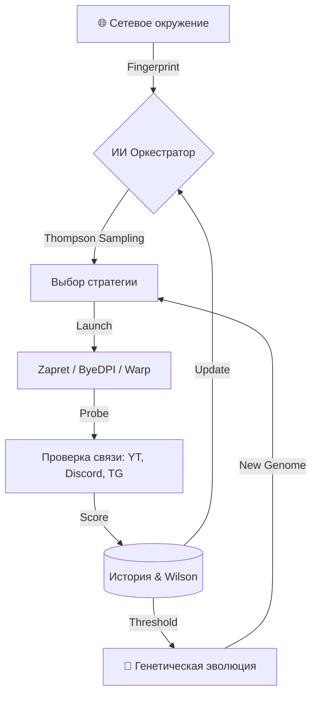

<picture>
    <source media="(prefers-color-scheme: dark)" srcset="./assets/FluxRoute-white.svg">
    <source media="(prefers-color-scheme: light)" srcset="./assets/FluxRoute-dark.svg">
    
</picture>

# FluxRoute AI `v1.6.2`

**Профессиональный менеджер инструментов обхода DPI с адаптивным интеллектом и поддержкой Cloudflare Warp.**

[🇬🇧 English Version](README.en.md) | [📥 Скачать](https://github.com/mx57/FluxRoute_AI/releases) | [💬 Обсуждение](https://github.com/mx57/FluxRoute_AI/issues)

---

**FluxRoute AI** — это мощное расширение оригинального FluxRoute, превращающее статический менеджер BAT-файлов в динамическую, самообучающуюся систему. Приложение не просто запускает Zapret или ByeDPI, оно **анализирует** качество связи и **эволюционирует**, создавая идеальные конфигурации под вашу конкретную сеть.

---

## 💎 Особенности этого форка (FluxRoute AI)

В отличие от оригинального проекта, FluxRoute AI фокусируется на автоматизации «последней мили» — подборе рабочих параметров в условиях меняющихся блокировок.

### 🧠 1. Продвинутый ИИ-оркестратор
*   **Thompson Sampling:** Математически обоснованный выбор стратегий. Система балансирует между использованием проверенных профилей и исследованием новых.
*   **Wilson Scoring:** Ранжирование профилей на основе доверительного интервала Вилсона. Чем больше успешных проверок, тем выше «авторитет» профиля.
*   **Fast Start (Ускоренный запуск):** При старте или смене сети ИИ мгновенно тестирует ТОП-3 лучшие стратегии из истории, обеспечивая минимальное время простоя.
*   **Network Fingerprinting:** ИИ помнит, что работает дома через Wi-Fi, а что — в кафе или через мобильный модем. Своя политика на каждую сеть.

### 🧬 2. Генетическая эволюция стратегий
*   **Авто-генерация BAT:** Система скрещивает параметры лучших профилей и применяет мутации (изменение desync, split-pos, fake-tls и др.), создавая новые профили в `engine/ai-evolved/`.
*   **Естественный отбор:** Профили, не прошедшие проверку качества, автоматически удаляются, очищая генофонд от мусора.

### 🌐 3. Полная интеграция Cloudflare Warp
*   **Встроенный Warp (warp-plus):** Поддержка протоколов WireGuard и AmneziaWG для обхода блокировок по IP.
*   **Авто-генерация конфигов:** Создание и регистрация Warp-аккаунтов прямо в приложении одной кнопкой.
*   **Auto-MTU Tuning:** ИИ автоматически подбирает размер MTU для Warp, если замечает потерю пакетов или нестабильность.

### 🔗 4. Гибридные и Цепные режимы (Chaining)
*   **Parallel:** Запуск Zapret и Warp одновременно.
*   **Chained:** Использование Warp как SOCKS5-прокси для Zapret или ByeDPI. Двойной уровень защиты.
*   **Hybrid:** Умное переключение между Zapret и ByeDPI в зависимости от того, чья стратегия сейчас эффективнее.

---

## 🚀 Новое в v1.6.2

*   **Интеграция Warp:** Добавлена полноценная вкладка управления Warp и генератор ключей.
*   **Улучшенные мутации:** ИИ теперь умеет подбирать параметры `DesyncAnyProtocol`, `DesyncFooling` и `FakeResend`.
*   **Оптимизация кеширования:** Значительно ускорена работа с историей проб, снижена нагрузка на диск.
*   **UI/UX:** Добавлены индикаторы типа движка в список стратегий и расширенная диагностика сети.

---

## 🛠 Как это работает? (Архитектура)

---

## 📅 Дорожная карта (Будущие улучшения)

*   [ ] **Поддержка Sing-Box:** Интеграция универсального ядра для работы с VLESS/Vmess/Reality.
*   [ ] **Облачная база знаний:** Возможность анонимно делиться успешно эволюционировавшими геномами с другими пользователями.
*   [ ] **Углубленный анализ YouTube:** Проверка не только доступности, но и скорости загрузки видео (буферизации).
*   [ ] **Локальный VPN-интерфейс:** Встроенный провайдер TUN/TAP для маршрутизации всего системного трафика без WinDivert.

---

## ⚠️ Важное замечание (WinDivert)

Приложение использует драйвер **WinDivert** для низкоуровневого анализа трафика. Некоторые антивирусы могут определять его как `HackTool` или `RiskTool`. Это является **ложноположительным** срабатыванием. Пожалуйста, добавьте FluxRoute в исключения вашего защитного ПО.

---

## 🙏 Благодарности

*   **[klondike0x/FluxRoute](https://github.com/klondike0x/FluxRoute)** — основа проекта, отличная архитектура.
*   **[bol-van/zapret](https://github.com/bol-van/zapret)** — мощнейшее ядро для Windows.
*   **[hiddify/warp-plus](https://github.com/hiddify/warp-plus)** — за реализацию Warp.

---

**[⭐ Поставь звезду репозиторию](https://github.com/mx57/FluxRoute_AI) — это лучшая мотивация для развития проекта!**

[mx57](https://github.com/mx57) © 2026. Лицензия GPLv3.

